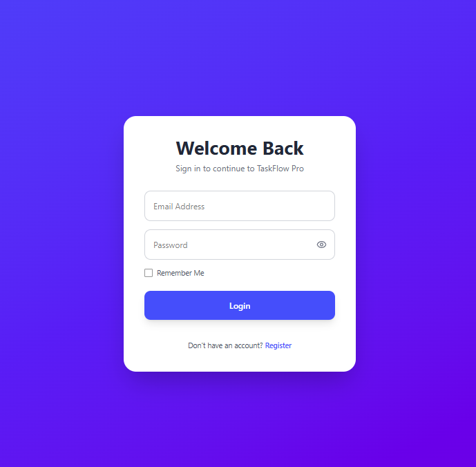
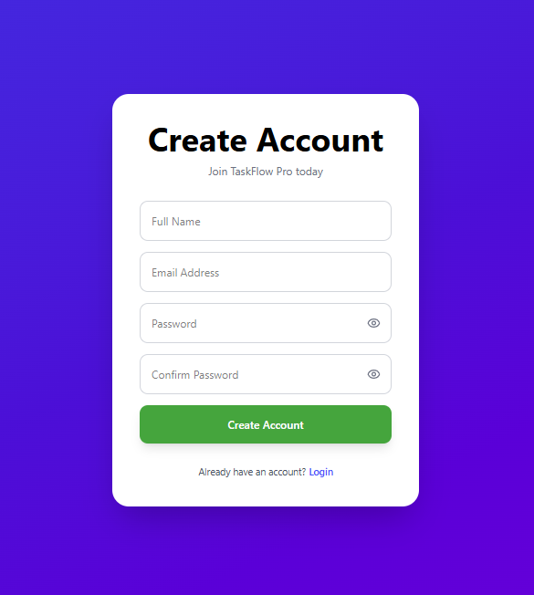
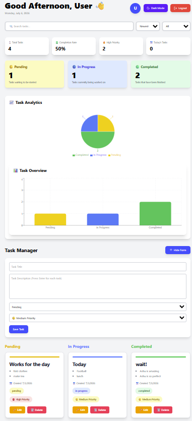
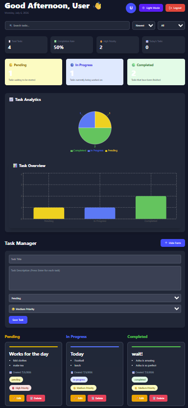
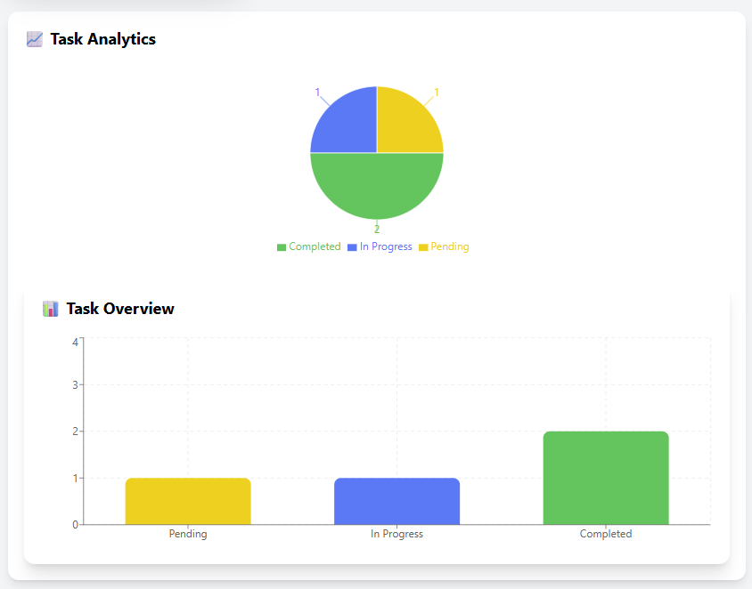

# 🚀 TaskFlow Pro

A modern full-stack Kanban Task Management application built with React, Node.js, Express, PostgreSQL, and Framer Motion.

---

## 🌐 Live Demo

**Frontend:** Coming Soon

**Backend API:** https://taskflow-pro-api-1v0k.onrender.com

---

## 📌 Features

- 🔐 JWT Authentication
- 👤 User Registration & Login
- ✅ Create, Edit & Delete Tasks
- 📋 Kanban Board
- 🎯 Drag & Drop Task Management
- 🔎 Search Tasks
- 🗂 Filter by Status
- ↕ Sort Tasks
- 🌙 Dark Mode
- 📊 Task Analytics Dashboard
- 🎨 Smooth Framer Motion Animations
- 📱 Fully Responsive Design

---

## 🛠 Tech Stack

### Frontend

- React
- Vite
- Tailwind CSS
- Axios
- React Beautiful DnD
- Recharts
- Framer Motion
- React Hot Toast
- Lucide React

### Backend

- Node.js
- Express.js
- PostgreSQL
- JWT Authentication
- bcrypt
- CORS

---

## 📂 Project Structure

```
client/
server/
database/
docs/
```


---

## 📸 Screenshots

### 🔐 Login



---

### 📝 Register



---

### 📋 Dashboard (Light Mode)



---

### 🌙 Dashboard (Dark Mode)



---

### 📊 Analytics Dashboard



---

## ⚙ Installation

### Clone Repository

```bash
git clone https://github.com/KXRMX23/taskflow-pro.git
```

### Install Dependencies

```bash
cd client
npm install

cd ../server
npm install
```

---

## 🔑 Environment Variables

### Client (.env)

```env
VITE_API_BASE_URL=https://your-backend-url.onrender.com
```

### Server (.env)

```env
PORT=5000
DATABASE_URL=your_postgresql_connection_string
JWT_SECRET=your_jwt_secret
```

> **Note:** Never commit real secrets or production credentials to GitHub.

---

### Start Backend

```bash
npm run dev
```

### Start Frontend

```bash
cd client
npm run dev
```

---

## ✨ Major Features

- Secure Authentication
- Beautiful Dashboard
- Task Analytics
- Responsive UI
- Drag & Drop Workflow
- Animated Interface
- Dark Mode
- Empty State
- Loading Screens

---

## 📊 Analytics

The dashboard displays:

- Pending Tasks
- In Progress Tasks
- Completed Tasks

using interactive charts powered by Recharts.

---

---

## 🚀 Deployment

### Frontend
- Vercel (Coming Soon)

### Backend
- Render

### Database
- PostgreSQL

---

## 🚀 Future Improvements

- Email Notifications
- Due Dates
- Team Collaboration
- File Attachments
- Calendar View
- Mobile Application

---

## 👨‍💻 Author

**K V Ritvick Sai**

GitHub:
https://github.com/KXRMX23

LinkedIn:
https://www.linkedin.com/in/k-ritvick-ba626a2a8/

If you like this project, feel free to ⭐ the repository!

---

## 📄 License

This project is licensed under the MIT License.